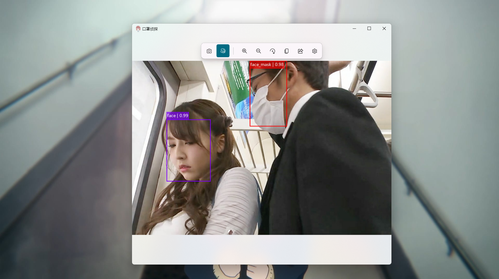

# Face-Mask-Detector
A face mask detector based on STM32F103ZET6 and Yolov4.


## Interface



## Compile and Load
You should install `arm-none-eabi-gcc` to compire.

```sh
cd stm32
make update
```


## Build Environment
1. Create virtual environment:

    ```shell
    conda create -n Face_Mask_Detector python=3.8
    conda activate Face_Mask_Detector
    pip install -r requirements.txt
    ```

2. Install [PyTorch](https://pytorch.org/), refer to the [blog](https://blog.csdn.net/qq_23013309/article/details/103965619) for details.


## Train
1. Download face mask dataset from [kaggle](https://www.kaggle.com/datasets/zhiyiyo/face-mask-dataset) and unzip it.

2. Download pre-trained `CSPDarknet53.pth` model from [Google Drive](https://drive.google.com/file/d/12oV8QL937S1JWFQhzLNPoqyYc_bi0lWT/view?usp=sharing).

3. Modify the value of `root` in `train.py`, please ensure that the directory structure of the `root` folder is as follows:

    ```txt
    root
    ├───Annotations
    ├───ImageSets
    │   ├───Layout
    │   ├───Main
    │   └───Segmentation
    ├───JPEGImages
    ├───SegmentationClass
    └───SegmentationObject
    ```

4. start training:

    ```sh
    cd algorithm
    conda activate Face_Mask_Detector
    python train.py
    ```

## Evaluation
### one model
1. Modify the value of `root` and `model_path` in `eval.py`.
2. Calculate mAP:

    ```sh
    cd algorithm
    conda activate Face_Mask_Detector
    python eval.py
    ```

### multi models
1. Modify the value of `root` and `model_dir` in `evals.py`.
2. Calculate and plot mAP:

    ```shell
    cd algorithm
    conda activate Face_Mask_Detector
    python evals.py
    ```

### mAP curve


## Detection
1. Modify the `model_path` and `image_path` in `demo.py`.

2. Display detection results:

    ```shell
    cd algorithm
    conda activate Face_Mask_Detector
    python demo.py
    ```


## License
```txt
MIT License

Copyright (c) 2022 Huang Zhengzhi

Permission is hereby granted, free of charge, to any person obtaining a copy
of this software and associated documentation files (the "Software"), to deal
in the Software without restriction, including without limitation the rights
to use, copy, modify, merge, publish, distribute, sublicense, and/or sell
copies of the Software, and to permit persons to whom the Software is
furnished to do so, subject to the following conditions:

The above copyright notice and this permission notice shall be included in all
copies or substantial portions of the Software.

THE SOFTWARE IS PROVIDED "AS IS", WITHOUT WARRANTY OF ANY KIND, EXPRESS OR
IMPLIED, INCLUDING BUT NOT LIMITED TO THE WARRANTIES OF MERCHANTABILITY,
FITNESS FOR A PARTICULAR PURPOSE AND NONINFRINGEMENT. IN NO EVENT SHALL THE
AUTHORS OR COPYRIGHT HOLDERS BE LIABLE FOR ANY CLAIM, DAMAGES OR OTHER
LIABILITY, WHETHER IN AN ACTION OF CONTRACT, TORT OR OTHERWISE, ARISING FROM,
OUT OF OR IN CONNECTION WITH THE SOFTWARE OR THE USE OR OTHER DEALINGS IN THE
SOFTWARE.
```